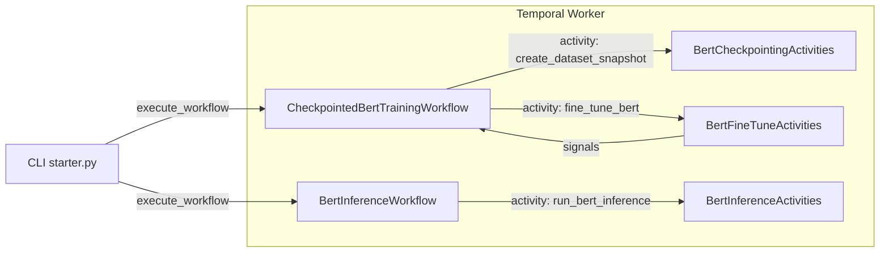

# Creating the BERT Checkpointing Demo from `bert_finetune`

This document is a **step‑by‑step build log** for evolving the baseline `bert_finetune` example into the more advanced `bert_checkpointing` package. It is meant as a teaching aid for how to add dataset snapshots and checkpoint‑aware resumption on top of an existing Temporal + BERT workflow.

> Starting point: you already have a working `bert_finetune` package with:
> - `custom_types.py` (BERT fine-tune/inference + experiment types)
> - `bert_activities.py` (fine-tune + inference activities)
> - `bert_workflow.py` (fine-tune + inference workflows)
> - `worker.py`, `train.py`, `inference.py`, and tests.
>
> Goal: a small, reproducible package that runs **checkpoint‑aware BERT fine‑tuning + inference** on Temporal, with dataset snapshots and resumable training.

---

## 0. Prerequisites

- Python 3.12+
- A Temporal dev server:

  ```bash
  temporal server start-dev
  ```

- `uv` for env + deps:

  ```bash
  pip install uv
  ```

**Why this step**

You need a modern Python runtime, a running Temporal server, and a reproducible environment tool (`uv`) so that the rest of the tutorial focuses on *workflow design* instead of local setup issues. Temporal is your orchestration engine; everything else (Transformers, datasets, Torch) hangs off of it.

---

## 1. Directory and dependency scaffold

From your existing repo (which already has `bert_finetune`):

**Why this step**

We create a new, self‑contained module (`bert_checkpointing`) alongside `bert_finetune` that mirrors the same structure—workflows, activities, worker, entrypoint, and tests—but extends the behavior with snapshots and checkpointing. Creating the files up front gives you clear “slots” to fill in as you read the rest of the tutorial.

```bash
mkdir -p src/workflows/train_tune/bert_checkpointing/tests
touch src/workflows/train_tune/bert_checkpointing/{__init__.py,custom_types.py,bert_activities.py,workflow.py,worker.py,starter.py}
```

If you are extending the same repo that already powers `bert_finetune`, you can usually reuse its `pyproject.toml`. If you are creating a standalone repo, add a minimal `pyproject.toml` (see this project’s root for a complete example) with at least:

- `temporalio`
- `pydantic`
- `transformers[torch]`
- `datasets`
- `torch`

Then install:

```bash
uv sync --dev
```

`pyproject.toml` pins your runtime dependencies, while `uv` handles virtualenv + lockfile management. Having these in place early makes sure your later imports (`temporalio`, `transformers`, `datasets`, `torch`) behave the same way across machines.

---

## 2. Shared data models (`custom_types.py`)

Start from the types you already have in `bert_finetune.custom_types` and extend them with snapshot and checkpoint metadata. These Pydantic models will be shared by:

- Workflows (inputs/outputs).
- Activities (inputs/outputs).
- External clients (CLI scripts).

**Why this step**

Temporal workflows and activities talk to each other via **typed payloads**. Centralizing those types in `custom_types.py` gives you:

- A single source of truth for fields and validation.
- Reusable models for both Temporal code and external clients.
- Easy schema evolution (you can see all versions in one place instead of scattered across files).

Key types to add on top of `bert_finetune`:

1. **Dataset snapshot**
   - `DatasetSnapshotRequest`:
     - `run_id: str`
     - `dataset_name: str`
     - `dataset_config: str`
     - `max_samples: int | None = None`
     - `snapshot_dir: str = "./data_snapshots"`
   - `DatasetSnapshotResult`:
     - `snapshot_id: str`
     - `dataset_name: str`
     - `dataset_config: str`
     - `num_train_samples: int`
     - `num_eval_samples: int`
     - `data_hash: str`
     - `snapshot_timestamp: str`
     - `snapshot_path: str`

**Why this segment**

Dataset snapshots give you a **stable view of the training data**. Instead of pointing training directly at a moving HF dataset, you materialize a slice into a content‑addressed directory. That:

- Makes runs reproducible even if the upstream dataset changes.
- Lets you reuse the same snapshot across multiple training jobs.
- Gives you something concrete to inspect on disk when debugging.

2. **Checkpoint metadata**
   - `CheckpointInfo`:
     - `epoch: int`
     - `step: int`
     - `path: str`
     - `loss: float`
     - `timestamp: str`

**Why this segment**

`CheckpointInfo` is the *small* payload that flows over Temporal signals. It captures just enough information to:

- Expose progress (epoch, step, loss) via workflow queries.
- Tell the workflow where the most recent checkpoint lives on disk.

By keeping this lean, you avoid shoving large tensors or artifacts into workflow history while still being able to resume correctly.

3. **Training configuration and IO**
   - `BertFineTuneConfig` (what one training run looks like):
     - Model + dataset: `model_name`, `dataset_name`, `dataset_config_name`
     - Hyperparams: `num_epochs`, `batch_size`, `learning_rate`, `max_seq_length`
     - Sampling: `max_train_samples`, `max_eval_samples`, `shuffle_before_select`
     - Schema hints: `text_field`, `text_pair_field`, `label_field`, `task_type`
     - Repro: `seed: int`
     - Identity: `run_id: str | None`
   - `BertFineTuneRequest`:
     - `run_id: str`
     - `config: BertFineTuneConfig`
     - `dataset_snapshot: DatasetSnapshotResult | None`
     - `resume_from_checkpoint: str | None`
   - `BertFineTuneResult`:
     - `run_id: str`
     - `config: BertFineTuneConfig`
     - `train_loss: float`
     - `eval_accuracy: float | None`
     - `training_time_seconds: float`
     - `num_parameters: int`
     - `dataset_snapshot: DatasetSnapshotResult | None`
     - `total_checkpoints_saved: int`

**Why this segment**

Splitting **config**, **request**, and **result** into three models gives you clean boundaries:

- `BertFineTuneConfig` is a pure configuration object: easy to serialize, reuse, or store in a config repo.
- `BertFineTuneRequest` adds runtime context (which snapshot to use, where to resume from).
- `BertFineTuneResult` is the canonical “what happened” record you can index, log, or store in a registry.

This mirrors real ML systems where the same configuration can produce many runs with different seeds, snapshots, or code versions.

4. **Inference IO**
   - `BertInferenceRequest`:
     - `run_id: str`
     - `texts: list[str]`
     - `max_seq_length: int`
     - `use_gpu: bool`
   - `BertInferenceResult`:
     - `run_id: str`
     - `texts: list[str]`
     - `predicted_labels: list[int]`
     - `confidences: list[float]`

Keep this module free of Temporal imports and workflow logic.

**Why this segment**

Inference often lives on a different code path (online service, batch scoring job), but it still needs strong types. By defining `BertInferenceRequest` and `BertInferenceResult` here, you:

- Reuse the same schema between Temporal workflows and any external caller.
- Make it trivial to plug in other frontends (REST API, CLI, notebook) without duplicating types.

---

## 3. ML activities (`bert_activities.py`)

The activities own all **non‑deterministic** ML logic: dataset access, tokenization, model training, checkpointing, and inference. We split them into three logical groups.

**Why this step**

Temporal workflows must stay deterministic—no direct network calls, file I/O, or random operations. Activities are where you are allowed to do “real world” work. Designing them first forces you to keep orchestration and side effects separate, which makes workflows safer to replay and easier to test.

### 3.1 Dataset snapshot activity

Class: `BertCheckpointingActivities`

- Sync helper:

  ```python
  def _create_dataset_snapshot_sync(request: DatasetSnapshotRequest) -> DatasetSnapshotResult:
      raw = load_dataset(
          request.dataset_name,
          request.dataset_config,
          trust_remote_code=True,
      )
      train = raw["train"]

      if request.max_samples and request.max_samples < len(train):
          train = train.select(range(request.max_samples))

      # Hash a stable projection of each row
      hasher = hashlib.sha256()
      for idx in sorted(range(len(train))):
          ex = train[idx]
          content = f"{ex.get('sentence', '')}|{ex.get('label', '')}"
          hasher.update(content.encode("utf-8"))

      data_hash = hasher.hexdigest()[:16]
      snapshot_id = f"{request.dataset_name}-{request.dataset_config}-{data_hash}"
      snapshot_path = Path(request.snapshot_dir) / snapshot_id
      ...
  ```

- Async activity:

  ```python
  @activity.defn
  async def create_dataset_snapshot(request: DatasetSnapshotRequest) -> DatasetSnapshotResult:
      snapshot = await asyncio.to_thread(
          BertCheckpointingActivities._create_dataset_snapshot_sync,
          request,
      )
      return snapshot
  ```

**Why this segment**

The sync helper does the heavy lifting (HF `load_dataset`, hashing, JSONL export), while the async wrapper:

- Keeps the Temporal event loop responsive (`asyncio.to_thread`).
- Presents a clean `@activity.defn` surface to workflows.

This pattern also makes it trivial to unit‑test snapshotting without spinning up a Temporal worker—you call `_create_dataset_snapshot_sync` directly in tests.

### 3.2 Fine‑tuning activity

Class: `BertFineTuneActivities`

- Helper: `compute_metrics(eval_pred)` returns `{"accuracy": ...}`.
- Sync core:

  ```python
  def _fine_tune_bert_sync(self, request: BertFineTuneRequest) -> BertFineTuneResult:
      config = request.config
      self.config = config

      # Device
      if config.use_gpu and torch.cuda.is_available():
          device = torch.device("cuda")
      elif config.use_gpu and hasattr(torch.backends, "mps") and torch.backends.mps.is_available():
          device = torch.device("mps")
      else:
          device = torch.device("cpu")

      # Dataset (snapshot first, raw fallback)
      if request.dataset_snapshot is not None:
          data_path = Path(request.dataset_snapshot.snapshot_path) / "data.jsonl"
          raw = load_dataset("json", data_files=str(data_path))
      else:
          raw = load_dataset(config.dataset_name, config.dataset_config_name)
      ...
      trainer = Trainer(
          model=model,
          args=training_args,
          train_dataset=train_ds,
          eval_dataset=eval_ds,
          compute_metrics=self.compute_metrics if eval_ds is not None else None,
      )

      # Resume from checkpoint if we have one
      resume_path = request.resume_from_checkpoint or detect_latest_checkpoint(training_args.output_dir)
      train_result = trainer.train(resume_from_checkpoint=resume_path)
      metrics = trainer.evaluate() if eval_ds is not None else {}
      ...
      return BertFineTuneResult(...)
  ```

- Async wrapper:

  ```python
  @activity.defn
  async def fine_tune_bert(self, request: BertFineTuneRequest) -> BertFineTuneResult:
      training_task = asyncio.create_task(
          asyncio.to_thread(self._fine_tune_bert_sync, request)
      )
      try:
          while not training_task.done():
              activity.heartbeat({"run_id": request.run_id})
              await asyncio.sleep(HEARTBEAT_INTERVAL_SECONDS)
          return await training_task
      finally:
          ...
  ```

**Why this segment**

Fine‑tuning is long‑running and GPU‑heavy, which is exactly the kind of work you do **not** want on the workflow thread. Splitting into:

- `_fine_tune_bert_sync` for pure ML logic.
- `fine_tune_bert` for Temporal heartbeats and offloading.

gives you:

- Robustness: heartbeats let Temporal detect stuck or cancelled work.
- Clarity: the sync helper can be imported and tested in isolation.
- Resume support: the helper knows how to restart from an existing checkpoint path.

### 3.3 Inference activity

Class: `BertInferenceActivities`

- Sync core:

  ```python
  def _run_bert_inference_sync(self, request: BertInferenceRequest) -> BertInferenceResult:
      model_dir = f"./bert_runs/{request.run_id}"
      tokenizer = AutoTokenizer.from_pretrained(model_dir)
      model = AutoModelForSequenceClassification.from_pretrained(model_dir)
      model.to(device)
      model.eval()
      ...
      return BertInferenceResult(
          run_id=request.run_id,
          texts=list(request.texts),
          predicted_labels=predicted.tolist(),
          confidences=confidences.tolist(),
      )
  ```

- Async wrapper:

  ```python
  @activity.defn
  async def run_bert_inference(self, request: BertInferenceRequest) -> BertInferenceResult:
      return await asyncio.to_thread(self._run_bert_inference_sync, request)
  ```

**Why this segment**

Inference is cheap compared to training but still involves model and tokenizer I/O, so it belongs in an activity. Reusing the same `_run_bert_inference_sync` pattern keeps the design symmetric with training and lets you test prediction logic with plain unit tests.

---

## 4. Workflows (`workflow.py`)

Workflows must be deterministic. All imports that may drag in non‑deterministic code (e.g., Pydantic models) are wrapped with `workflow.unsafe.imports_passed_through()`.

```python
from datetime import timedelta
from temporalio import workflow

with workflow.unsafe.imports_passed_through():
    from .custom_types import (
        BertFineTuneConfig,
        BertFineTuneRequest,
        BertFineTuneResult,
        BertInferenceRequest,
        BertInferenceResult,
        CheckpointInfo,
        DatasetSnapshotRequest,
        DatasetSnapshotResult,
    )
```

**Why this step**

This is where you define the *orchestration* logic. The `workflow.unsafe.imports_passed_through()` block tells Temporal’s Python SDK “these imports are safe to replay as‑is,” while the workflow methods themselves must avoid side effects and use Temporal APIs (activities, signals, queries, timers) instead of raw I/O.

### 4.1 Checkpointed training workflow

Key logic:

- Maintain latest checkpoint info via a **signal**.
- Query method exposes it to external callers.
- Run flow:
  1. Derive / normalize `run_id`.
  2. Execute `create_dataset_snapshot`.
  3. Execute `fine_tune_bert`, passing in:
     - `run_id`
     - `BertFineTuneConfig`
     - `DatasetSnapshotResult`
     - Optional `resume_from_checkpoint` path from the latest recorded checkpoint.

The workflow is agnostic to the file system; it only passes paths around.

**Why this segment**

`CheckpointedBertTrainingWorkflow` is the brain of the training run:

- It normalizes `run_id` so that runs are easy to reason about.
- It ensures every training job uses a well‑defined dataset snapshot, which gives you reproducibility.
- It manages resume behavior without ever touching the filesystem directly—only the activities know about actual paths.

Keeping the workflow “blind” to local disk layout is what makes it portable across workers and safe to replay.

### 4.2 Inference workflow

Very small:

- Accept `BertInferenceRequest` (or dict).
- Call `run_bert_inference` activity.
- Normalize back to `BertInferenceResult`.

**Why this segment**

The inference workflow is intentionally tiny: it exists to show how you would **wrap a single activity** behind a Temporal boundary. That gives you:

- A durable record that inference happened (inputs + outputs live in history).
- A place to hang queries, signals, or versioning later if you evolve the behavior.
- A way to use your model for some inference after doing training

---

## 5. Worker wiring (`worker.py`)

The worker connects to Temporal, registers workflows and activities, and listens on a task queue.

Core elements:

- `Client.connect("localhost:7233", data_converter=pydantic_data_converter)`
- `Worker(..., task_queue="bert-checkpointing-task-queue", workflows=[...], activities=[...])`
- `activity_executor=ThreadPoolExecutor(5)` to allow heavy ML work off the event loop.

Run it with:

```bash
uv run -m src.workflows.train_tune.bert_checkpointing.worker
```

**Why this step**

The worker is the “engine” that actually runs your workflows and activities. Centralizing registration here:

- Makes it easy to scale by adding more identical workers on the same task queue.
- Lets you run multiple separate workers (e.g., training vs. eval) if you later split task queues.
- Keeps Temporal concerns (task queues, executors) out of your ML code.

---

## 6. CLI starter (`starter.py`)

The starter script demonstrates the “happy path”:

1. Connect a Temporal client with the Pydantic data converter.
2. Build a `BertFineTuneConfig`:
   - Use a fixed `run_id` such as `"bert-checkpointed-training-demo-id"`.
3. Execute:

   ```python
   training_result = await client.execute_workflow(
       CheckpointedBertTrainingWorkflow.run,
       config,
       id="bert-checkpointed-training-demo-id",
       task_queue="bert-checkpointing-task-queue",
   )
   ```

4. Print training metrics.
5. Build `BertInferenceRequest(run_id=training_result.run_id, texts=[...])`.
6. Execute `BertInferenceWorkflow.run` and print predictions.

This is the entrypoint you can show to other engineers as the minimal usage example.

**Why this step**

The starter script is your **happy‑path demo**:

- It hides Temporal boilerplate behind a few copy‑pasteable commands.
- It exercises the full stack—client → workflow → activities → checkpoints → inference—so you can validate everything works together.
- It doubles as executable documentation: when in doubt, run the starter and follow what it does.

---

## 7. Tests (`tests/`)

Add at least:

- **Activity tests** using `ActivityEnvironment` with ML helpers mocked out.
- **Workflow tests** using a Temporal `Worker` and test client, with activities mocked:
  - One test for `CheckpointedBertTrainingWorkflow` verifying that:
    - It calls the snapshot + fine‑tune activities.
    - It forwards `run_id` correctly.
  - One test for `BertInferenceWorkflow` ensuring it delegates to the inference activity.

This keeps the demo reliable and prevents regressions during refactors.

**Why this step**

Temporal workflows and activities are just Python, so you can and should test them like regular code:

- Activity tests catch issues with request/result wiring without needing a Temporal server.
- Workflow tests validate determinism and correct use of activity names and options.

This is especially important for ML code where refactors are frequent and regressions are easy to miss by eye.

---

## 8. How the pieces fit (diagram)



This pattern generalizes to many other ML workloads:

- Swap in different models/datasets.
- Change checkpoint policies and resume behavior.
- Add evaluation workflows downstream.

**Why this step**

The diagram is the “mental model” for the whole module. If you can explain this picture to someone else, you understand how Temporal orchestrates your ML system—and you can confidently adapt the pattern to new workflows, datasets, or model families.
