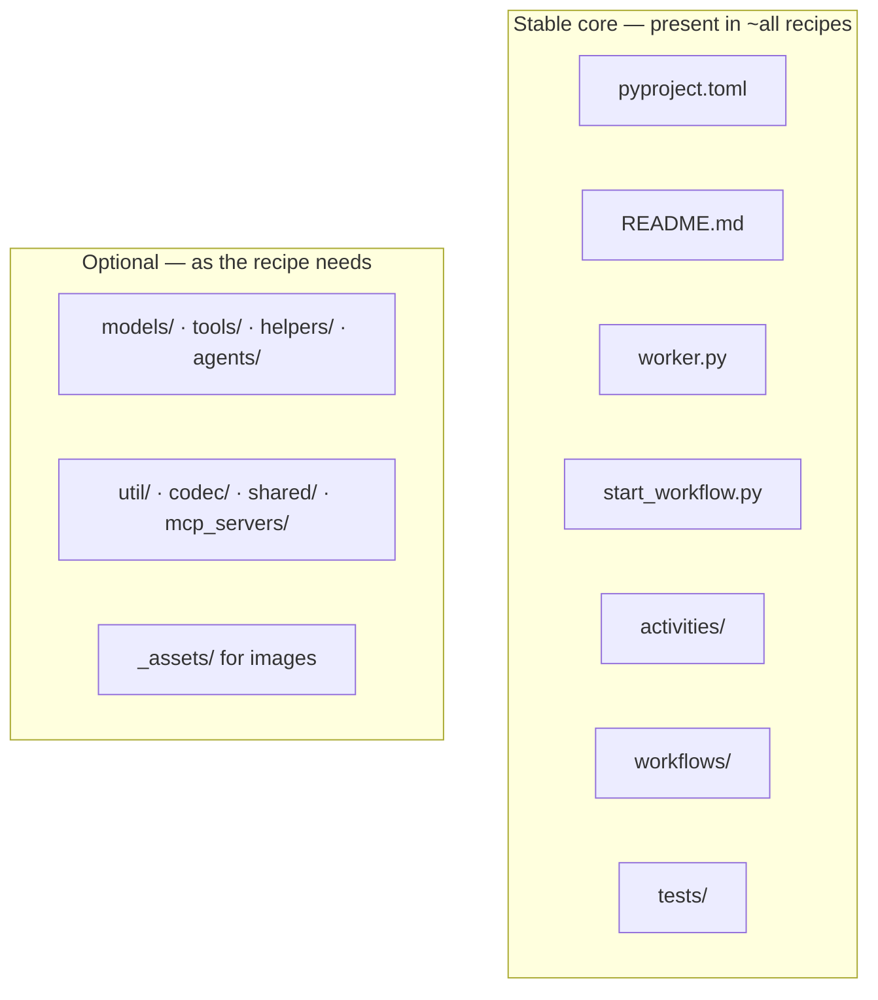
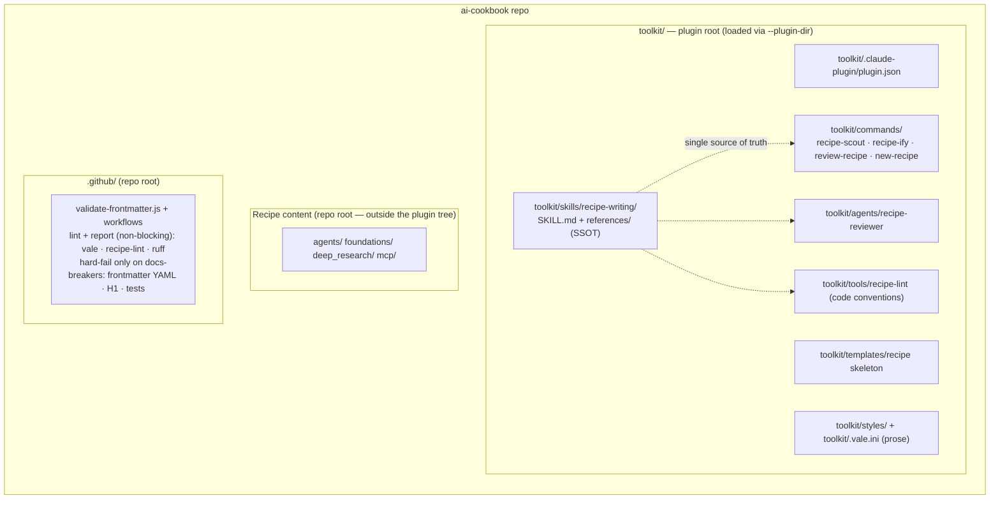
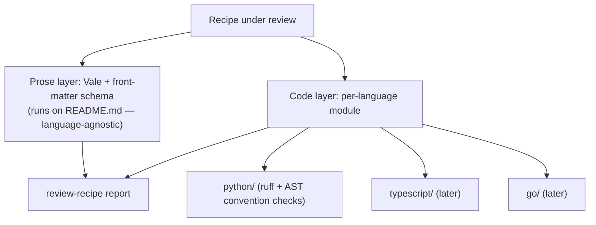

# Spec: AI Cookbook Authoring & Consistency Toolkit

## Status

Draft for review. No implementation has started. This spec captures the design for
turning the AI Cookbook into a self-consistent, tooled repository — modeled
structurally on the [Validated Patterns Toolkit](https://github.com/temporalio) (VPT),
but deliberately lighter, because the cookbook is a collection of **recipes**
(short, runnable "here's the code, here's how it works" examples), not tutorials,
validated patterns, or courses.

## Background

### What exists today

The cookbook is a content repository: ~12 published recipes across `foundations/`,
`agents/`, `deep_research/`, and `mcp/`. Each recipe is a self-contained Python
project (`worker.py`, `start_workflow.py`, `activities/`, `workflows/`, `tests/`,
`README.md`, `pyproject.toml`). CI validates README front matter (loosely) and runs
each changed recipe's tests.

PR #135 (Angie Byron) added the first piece of authoring tooling:

- `.claude/commands/recipe-scout.md` — points Claude at an external GitHub repo,
  mines reusable AI "building block" patterns, and emits reviewer-ready proposal cards.
- `.claude/commands/recipe-ify.md` — takes a pattern description or proposal card and
  generates a complete, runnable recipe.
- `agents/guardrails_hard_rules_python/` — a sample recipe produced by `recipe-ify`.

This built the **generation** half. It did not build the **consistency/validation**
half, and its conventions are embedded inline in the command prose (no single source
of truth, nothing enforces them after generation).

### The published-docs contract (load-bearing)

The live cookbook at `docs.temporal.io/ai-cookbook` is **generated from this repo**.
`temporalio/documentation` runs `bin/sync-ai-cookbook.js` as a `prebuild` step:

1. Clones `ai-cookbook` `main`.
2. Walks every `README.md` and converts each to an `.mdx` page (verbatim body).
3. Strips the `<!-- … -->` front-matter comment; the markdown body **is** the page.
4. Requires an H1 (`missing H1 title` is a hard error); promotes it to the page title.
5. Parses front matter with **real YAML (`js-yaml`)**; merges `description`, `tags`,
   `priority` into the docusaurus frontmatter (`priority` orders the category index;
   `last_updated` is auto-derived from git author date).
6. Slugifies the **recipe directory name** into the public URL; rewrites relative
   inter-recipe links to `./slug.mdx` and copies/rewrites `_assets/` images.

Implications this spec must respect:

- A recipe README **is** a published documentation page. Style rules are user-facing.
- The directory name is a permanent public URL. Renames are breaking unless aliased in
  the documentation repo's `SLUG_ALIASES`.
- Front matter must be valid YAML under `js-yaml`. The cookbook's current CI validator
  uses a loose homegrown parser, so front matter can pass CI yet break the docs build.
- Recipes must not hand-set `last_updated`; it is derived from git history.

## Goals

1. Establish a **single source of truth** for recipe conventions (prose + code) that
   generation, review, linting, and CI all reference.
2. Make the repo **self-consistent**: front matter, file layout, README structure, and
   Temporal/recipe code conventions converge to one documented standard.
3. Make **the skill the enforcer**, combining deterministic tooling with AI judgment,
   for both the prose layer (README/front matter) and the code layer (Python
   conventions). **CI lints and reports — it does not block** on style/consistency.
   The only CI hard-fails that remain are the ones that would break the published docs
   build (invalid YAML front matter, missing H1).
4. Package the toolkit as a **hybrid in-repo Claude Code plugin** (VPT's shape): the
   content repo also ships its own authoring plugin.
5. Keep it **lightweight** — proportional to a cookbook, not VP's ~30-rule program.
6. Be **language-extensible**: Python first, with a structure that admits TypeScript,
   Go, etc. later without rework.

## Non-goals

- Turning recipes into tutorials, validated patterns, or courses.
- Importing VPT's full rule set or its required-section program structure.
  - **Tension:** the more standardized the better, but an overbuilt rule set wards off
    contributors. Resolve this by putting the burden on tooling, not people — a
    low-friction "cookbook-ify my repo/recipe" on-ramp (via `recipe-ify` / `recipe-scout`)
    does the standardization for the contributor — and by being selective about which
    rules are enforced at all.
- Rewriting existing recipe *code* beyond convergence to documented conventions.
  - **But** convergence is the floor, not the ceiling: actively push code quality to the
    `python` skill's standards (ruff, strict type checking, modern Pythonic style). We
    ship reference-quality code, not just consistent code.
- Changing the docs-site sync mechanism (owned by `temporalio/documentation`).

## Decisions already made (from review)

| Decision | Choice |
| :--- | :--- |
| Toolkit home & packaging | Hybrid in-repo plugin **rooted in a `toolkit/` subdirectory** (`toolkit/.claude-plugin/plugin.json` + skill + commands + agent + styles + tools). Rooting in a subdir keeps the cookbook's `agents/` recipe category outside the plugin's component tree, avoiding the auto-discovery collision. Repo-level CI scripts stay at repo root. |
| Distribution | **Local only**, loaded via `claude --plugin-dir <repo>/toolkit`. Not published to a marketplace. Local `.claude/` skills/commands are acceptable for one-offs; the `toolkit/` plugin is the durable home. |
| Enforcement scope | Both prose and Python code now; language-extensible for other languages later. |
| Canonical README style | **Light code-walkthrough** (confirmed: READMEs render verbatim as docs pages; established pages use this style). The brief style is non-canonical. |
| Weight | Deliberately lighter than VPT — this is a cookbook. |
| Branch / PR flow | Work lands on `ai-cookbook-style`, branched from Angie's `recipe/guardrails-hard-rules`; merges back to her branch with her approval before reaching `main`. Angie's files are treated as upstream and are not modified as part of foundational work. |

## The emergent conventions (style guide, derived bottom-up)

These are extracted from the existing corpus, not imposed. They form the content of the
single source of truth.

### README structure — the canonical "code walkthrough"

The plurality of recipes (9–10 of 13) follow this shape, and it is what the docs site
publishes:

```
# Title                              (mandatory H1 — becomes the page title)
1–2 sentence intro                   ("…the LLM call happens in a Temporal Activity")
(optional) key design decisions  OR  ## Application Components overview
## Create the Activity               intro prose → *File: path* → ```code``` → explanation
## Create the Workflow               (light code-sandwich: introduce → show → explain)
## Create the Worker
## Create the Workflow Starter
## Running
```

This is a **light** code-sandwich: no required Executive Summary / Problem / Outcomes
scaffolding. It exists to show each file's code and explain how it works.

Allowed variation: trivial single-file recipes may collapse sections, but must keep the
mandatory H1, an intro, and a `## Running` section.

### File layout — stable core + optional directories



**Tests are mandatory.** Every recipe must ship a `tests/` suite, even when that means
mocking out the LLM/API so the tests run without credentials. No recipe is accepted
without tests.

Standardize away: stray top-level entry files that duplicate `start_workflow.py`
(`hello_world.py`, `claude_test.py`); inconsistent presence of `__init__.py` (pick one
convention).

### Front matter — stable schema, governed values

Front matter lives **only on `README.md`** — never in code files. Schema (all required,
validated against `js-yaml` semantics):

```markdown
<!--
description: One plain-text sentence describing what the recipe demonstrates.
tags: [category, language, provider]
priority: 500
-->
```

**Why an HTML comment and not `---` YAML front matter?** Two reasons, both fixed
constraints rather than preferences:

1. **GitHub rendering** — a recipe README is browsed directly on GitHub, where a `---`
   front-matter block renders as an ugly horizontal rule / table at the top of the page.
   An HTML comment is invisible there.
2. **The docs sync parses the comment** — `bin/sync-ai-cookbook.js` specifically extracts
   the `<!-- … -->` block, and we agreed not to change the sync mechanism (a non-goal).

So the HTML-comment form stays. (If we ever want to revisit it, it's blocked on both the
GitHub-render concern and a coordinated change to the docs sync — flagging the dependency.)

Rules to enforce:

- **Spacing**: `tags: [ … ]` (one space after the colon). No `tags:[…]`.
- **Tag vocabulary**: a controlled accept-list scoped to the cookbook. Resolve synonyms
  (`claude` vs `anthropic`) and one-offs (`toolcalling`, `claim-check`,
  `provider-neutral`, `s3`, `workflows`).
  - **Separate task (Mason owns):** a Temporal-wide tag vocabulary across all of
    Temporal's content properties. Vital, but out of scope here and tracked separately —
    the cookbook accept-list is the local subset for now.
- **Tag ordering**: documented order — category, then language, then provider.
- **`priority`**: documented bands derived from the values already in use (no churn —
  keep the existing relative ordering: foundations highest, then agents, then advanced)
  instead of treating 399–999 as arbitrary.
- **Do not** include `last_updated` or `title` in front matter; both are derived by the
  docs sync.

### Code conventions — already documented, currently unenforced

From `CLAUDE.md`, `CONTRIBUTING.md`, and `recipe-ify`:

- LLM clients constructed with `max_retries=0`.
- `pydantic_data_converter` in `Client.connect()` and in the test
  `WorkflowEnvironment`.
- Every activity call specifies `start_to_close_timeout`.
- API-boundary errors caught and re-raised as `ApplicationError(..., non_retryable=True)`.
- Task queue named `{recipe-name}-task-queue`; package named
  `cookbook-{recipe-name}-python`.
- `requires-python = ">=3.10,<3.14"`; `temporalio>=1.15.0,<2`.
- Tests use `@pytest.mark.asyncio` + `@pytest.mark.timeout(30)`, time-skipping env, and
  **mock activities** so no real API key is needed.
- Workflows are pure orchestration (no I/O / LLM calls).
- Current model names (for example `claude-sonnet-4-6`).
- **Quality bar** (from the `python` skill, not just convergence): `ruff` clean (lint +
  format) and strict type checking (`mypy --strict` or equivalent), modern Pythonic
  style. Recipes ship reference-quality code.

These are mechanically checkable and form the Python code-layer rules.

## Target architecture



Rooting the plugin in `toolkit/` (rather than the repo root) is deliberate: Claude Code
auto-discovers `agents/`, `commands/`, and `skills/` at the **plugin root**, and the
cookbook already uses `agents/` as a recipe **category**. Keeping the plugin under
`toolkit/` puts the recipe `agents/` directory outside the plugin's component tree, so
there is no collision. Components reference their own files via `${CLAUDE_PLUGIN_ROOT}/…`
(which resolves to the `--plugin-dir` target); CI invokes the same tools by repo path.

Core move: conventions live once, in `skills/recipe-writing/references/`. Generation
(`recipe-ify`), review (`review-recipe`), the reviewer agent, the linter, and CI all
reference that one definition instead of duplicating it. The **skill is the enforcer**
(deterministic tooling + AI judgment); CI lints and reports but does not block on
style/consistency — it hard-fails only on things that would break the published docs.

### Two-layer, language-extensible enforcement

A recipe is **code + prose**, so enforcement has two layers. The prose layer is
language-agnostic; the code layer dispatches by language.



`recipe-lint` detects language from the recipe directory suffix (`_python`, future
`_typescript`) and runs the matching module. Adding a language later is one new module,
no rework.

## Plan (phased)

### Phase 0 — Foundation: single source of truth + cheap CI fix

- Author `toolkit/skills/recipe-writing/references/`: `structure.md` (walkthrough README),
  `frontmatter.md` (schema, tag accept-list, priority bands, YAML rules), `layout.md`
  (directory conventions, naming, URL/slug contract), `code-conventions.md` (the
  Temporal/recipe Python rules).
- `toolkit/skills/recipe-writing/SKILL.md` entry point that loads the references.
- Fix `.github/scripts/validate-frontmatter.js`: enforce `tags` and `priority`, validate
  vocabulary/spacing/bands, and parse with real-YAML semantics to match the docs build.
  Reconcile `CONTRIBUTING.md`/`CLAUDE.md` claims with the validator.

### Phase 1 — Validation tooling (the missing half)

- `toolkit/tools/recipe-lint` (standalone uv CLI): AST/grep checks for `max_retries=0`,
  `pydantic_data_converter`, timeouts, `ApplicationError` boundaries, naming, model
  currency; plus relative-link and `_assets` checks. Language-dispatcher skeleton.
- `toolkit/styles/AICookbook/` + `toolkit/.vale.ini`: a **small** Vale rule set (front
  matter, heading case, banned marketing words, the `*File:*` convention). Not VPT's 30.
- `toolkit/commands/review-recipe` + `toolkit/agents/recipe-reviewer`: run Vale +
  recipe-lint + tests and produce a structured report (VPT's `review-pattern` analog).
- Wire `recipe-lint` and Vale into `.github/workflows` (invoked by repo path).

### Phase 2 — Reconcile generation with the source of truth

- Move `recipe-ify` / `recipe-scout` into `toolkit/commands/` and refactor them to
  reference the skill's `references/` (via `${CLAUDE_PLUGIN_ROOT}`) instead of inline
  conventions, and to generate the **canonical walkthrough README**.
- `toolkit/commands/new-recipe` + `toolkit/templates/` recipe skeleton (the `new-pattern`
  analog).
- Package: `toolkit/.claude-plugin/plugin.json`, command frontmatter (`allowed-tools`,
  `argument-hint`, `description`), `--plugin-dir` load instructions, and a root README
  documenting the three purposes (content / linter / plugin), mirroring VPT.

### Phase 3 — Backfill consistency

- Run the toolkit across all existing recipes; converge front matter, layout, and README
  style to canonical. This is where the repo becomes consistent in practice.
- **No directory renames in this phase.** Convergence does not require them, and renames
  carry a real cost (breaking a public URL) for no consistency benefit. Any rename that
  is ever genuinely warranted is handled as a separate, isolated branch coordinated with
  the docs `SLUG_ALIASES` — never folded into the consistency backfill.

## Risks & constraints

- **Slug/URL contract**: the recipe directory name is a permanent public URL. The
  consistency work (Phase 3) therefore does **not** rename anything — there's no
  consistency payoff that justifies breaking a live URL. If a rename is ever genuinely
  needed (a name that's actively misleading), it is done on its own dedicated branch and
  coordinated with `temporalio/documentation`'s `SLUG_ALIASES`, separate from this work.
- **Parser divergence**: the fix in Phase 0 must align the cookbook validator with the
  docs build's `js-yaml`; otherwise the two disagree.
- **Don't over-build**: every rule added must earn its place against the "it's a
  cookbook" bar. Prefer fewer, high-value checks.
- **Branch flow**: foundational work must not entangle Angie's PR; it merges back to her
  branch with her approval first.

## Resolved questions

1. **`recipe-lint` form** — Standalone Python CLI (installable/runnable via `uv`), usable
   by contributors locally as well as by CI and the review command.
2. **`priority` banding** — Keep the values already in use; preserve the existing relative
   ordering rather than inventing a new scheme.

## Open items

- **`human_in_the_loop` variant** — Deliver a PR that reconciles it to canonical, with a
  written rationale. The outcome may instead sanction its richer
  Overview/Architecture/Key-Patterns shape as an allowed variant — that's a decision to
  make on the PR, with evidence, not up front.
- **Temporal-wide tag vocabulary** — A controlled tag accept-list spanning all of
  Temporal's content (not just the cookbook). Vital but out of scope here; Mason owns
  this as a separate task.
